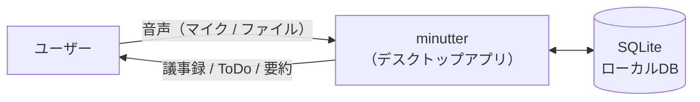
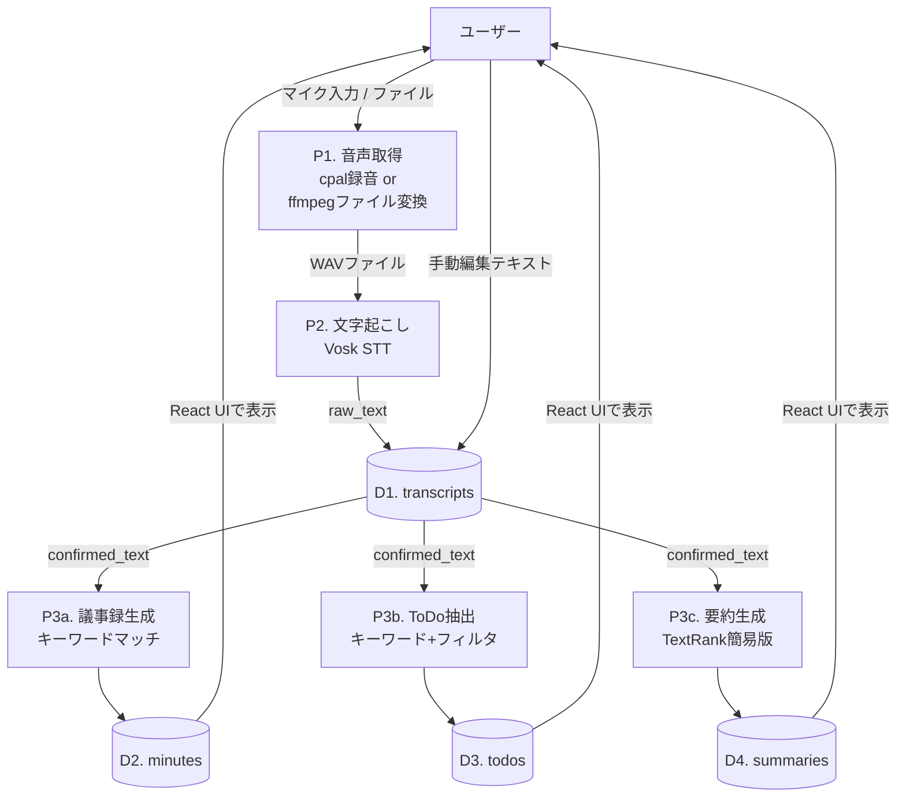

# DFD（データフロー図）

## レベル0：コンテキスト図

```mermaid
flowchart LR
    user["ユーザー"]
    app["minutter\n（デスクトップアプリ）"]
    db[("SQLite\nローカルDB")]

    user -- "音声（マイク / ファイル）" --> app
    app -- "議事録 / ToDo / 要約" --> user
    app <--> db
```

---

## レベル1：詳細フロー

```mermaid
flowchart TD
    user["ユーザー"]

    P1["P1. 音声取得\ncpal録音 or\nffmpegファイル変換"]
    P2["P2. 文字起こし\nVosk STT"]
    P3a["P3a. 議事録生成\nキーワードマッチ"]
    P3b["P3b. ToDo抽出\nキーワード+フィルタ"]
    P3c["P3c. 要約生成\nTextRank簡易版"]

    D1[("D1. transcripts")]
    D2[("D2. minutes")]
    D3[("D3. todos")]
    D4[("D4. summaries")]

    user -- "マイク入力 / ファイル" --> P1
    P1 -- "WAVファイル" --> P2
    P2 -- "raw_text" --> D1
    user -- "手動編集テキスト" --> D1
    D1 -- "confirmed_text" --> P3a
    D1 -- "confirmed_text" --> P3b
    D1 -- "confirmed_text" --> P3c
    P3a --> D2
    P3b --> D3
    P3c --> D4
    D2 -- "React UIで表示" --> user
    D3 -- "React UIで表示" --> user
    D4 -- "React UIで表示" --> user
```

**全データはローカル SQLite に永続保存される。**
