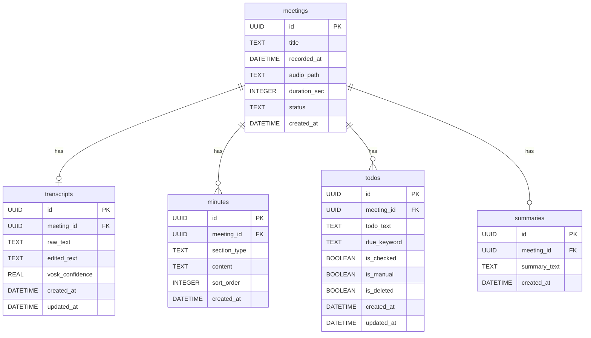

# ER図

シングルユーザー・セッション管理なし

## 設計上のポイント

- Web版に存在した sessions テーブルは不要のため含まない
- 全テーブルから session_id カラムを削除
- シングルユーザーのためアクセス制御は OS 権限に委譲
- `meetings.status` の値: `recording` / `processing` / `done` / `error`
- `minutes.section_type` の値: `decisions`（決定事項）/ `next`（次回議題）/ `body`（本文）
- `todos.is_deleted` は論理削除フラグ（物理削除しない）
