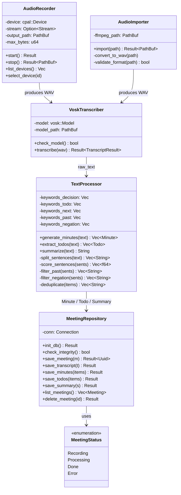

# クラス図（Rustモジュール構成）

## 補足

- `AudioImporter` は Tauri サイドカーとして ffmpeg を呼び出す
- `VoskTranscriber` は日本語モデル（約500MB）をバンドルする
- `TextProcessor` はルールベース処理のみ（外部 API・LLM 不使用）
- `MeetingRepository` は rusqlite のプリペアドステートメントを必須とする
