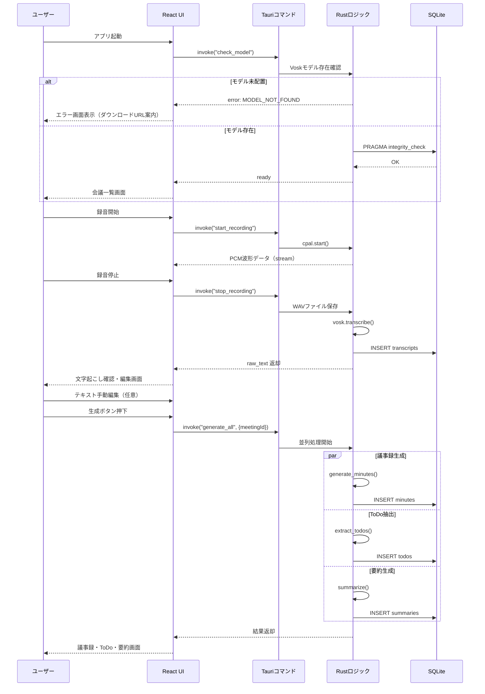
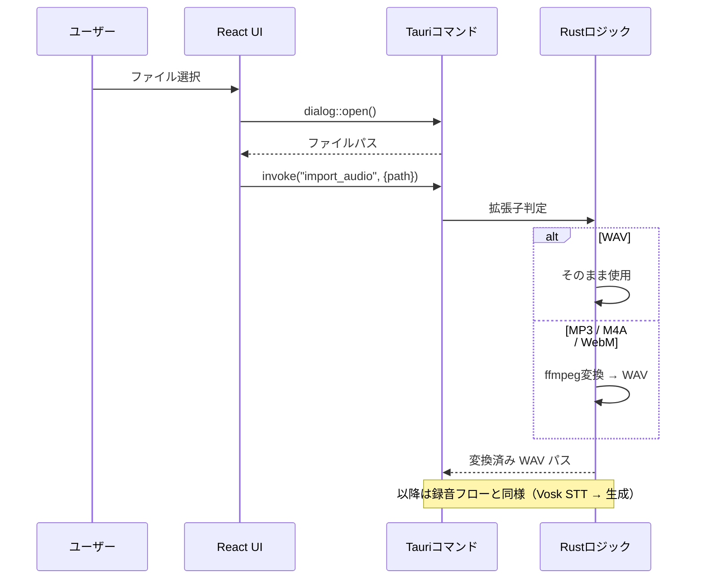
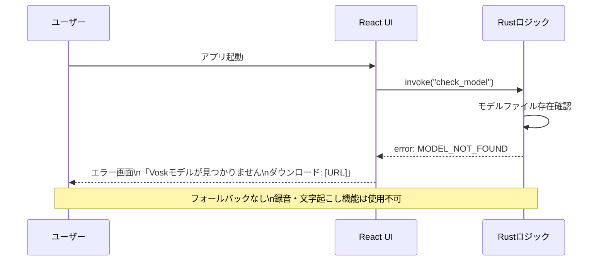

# シーケンス図

## 1. マイク録音 → 生成フロー

```mermaid
sequenceDiagram
    participant U as ユーザー
    participant UI as React UI
    participant TC as Tauriコマンド
    participant RS as Rustロジック
    participant DB as SQLite

    U->>UI: アプリ起動
    UI->>TC: invoke("check_model")
    TC->>RS: Voskモデル存在確認
    alt モデル未配置
        RS-->>UI: error: MODEL_NOT_FOUND
        UI-->>U: エラー画面表示（ダウンロードURL案内）
    else モデル存在
        RS->>DB: PRAGMA integrity_check
        DB-->>RS: OK
        RS-->>UI: ready
        UI-->>U: 会議一覧画面
    end

    U->>UI: 録音開始
    UI->>TC: invoke("start_recording")
    TC->>RS: cpal.start()
    RS-->>UI: PCM波形データ（stream）

    U->>UI: 録音停止
    UI->>TC: invoke("stop_recording")
    TC->>RS: WAVファイル保存
    RS->>RS: vosk.transcribe()
    RS->>DB: INSERT transcripts
    RS-->>UI: raw_text 返却
    UI-->>U: 文字起こし確認・編集画面

    U->>UI: テキスト手動編集（任意）
    U->>UI: 生成ボタン押下
    UI->>TC: invoke("generate_all", {meetingId})
    TC->>RS: 並列処理開始
    par 議事録生成
        RS->>RS: generate_minutes()
        RS->>DB: INSERT minutes
    and ToDo抽出
        RS->>RS: extract_todos()
        RS->>DB: INSERT todos
    and 要約生成
        RS->>RS: summarize()
        RS->>DB: INSERT summaries
    end
    RS-->>UI: 結果返却
    UI-->>U: 議事録・ToDo・要約画面
```

---

## 2. ファイルインポートフロー

```mermaid
sequenceDiagram
    participant U as ユーザー
    participant UI as React UI
    participant TC as Tauriコマンド
    participant RS as Rustロジック

    U->>UI: ファイル選択
    UI->>TC: dialog::open()
    TC-->>UI: ファイルパス
    UI->>TC: invoke("import_audio", {path})
    TC->>RS: 拡張子判定
    alt WAV
        RS->>RS: そのまま使用
    else MP3 / M4A / WebM
        RS->>RS: ffmpeg変換 → WAV
    end
    RS-->>TC: 変換済み WAV パス
    Note over RS,TC: 以降は録音フローと同様（Vosk STT → 生成）
```

---

## 3. Voskモデル未配置フロー

```mermaid
sequenceDiagram
    participant U as ユーザー
    participant UI as React UI
    participant RS as Rustロジック

    U->>UI: アプリ起動
    UI->>RS: invoke("check_model")
    RS->>RS: モデルファイル存在確認
    RS-->>UI: error: MODEL_NOT_FOUND
    UI-->>U: エラー画面\n「Voskモデルが見つかりません\nダウンロード: [URL]」
    Note over U,RS: フォールバックなし\n録音・文字起こし機能は使用不可
```
