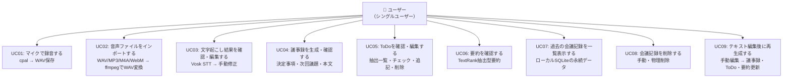

# ユースケース図

## ユースケース依存関係

| ユースケース | 前提条件 |
|-------------|---------|
| UC03 | UC01 または UC02 の完了後に実行可能 |
| UC04, UC05, UC06 | UC03 の完了後・生成ボタン押下で一括実行 |
| UC07 | いつでも参照可能（ローカル永続データ） |
| UC08 | UC07 から実行可能 |
| UC09 | UC03 完了後・UC04〜06 完了後の任意のタイミングで実行可能 |
