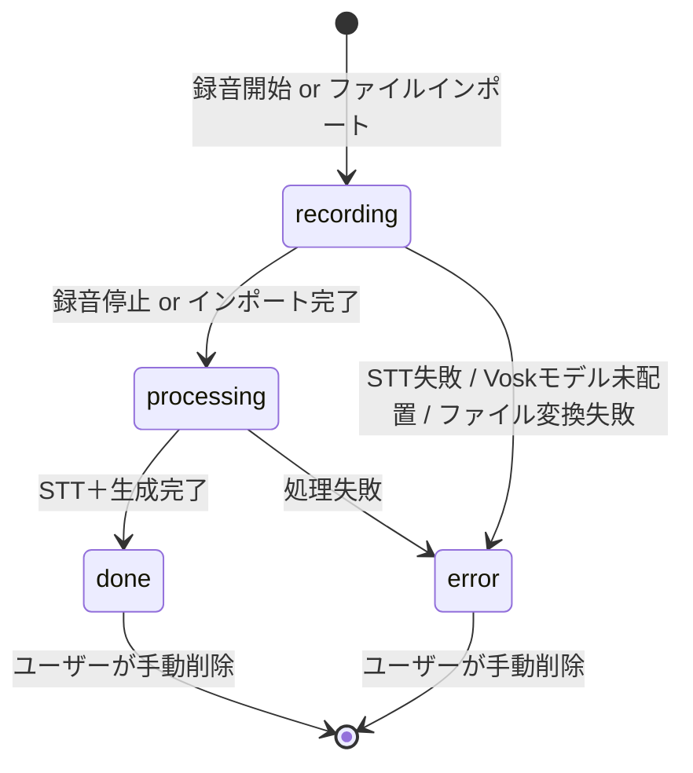
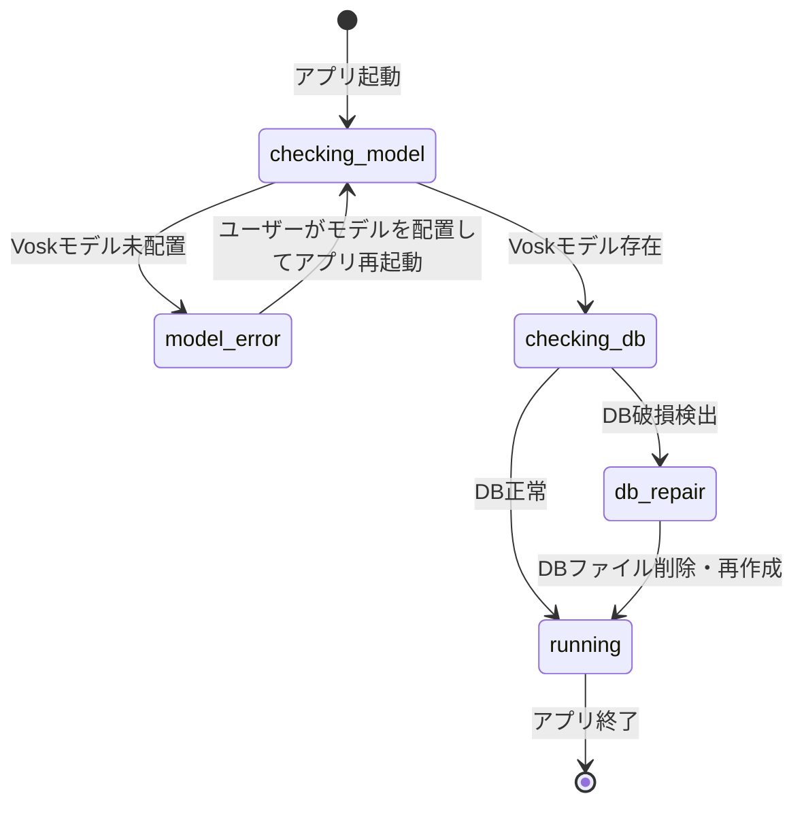
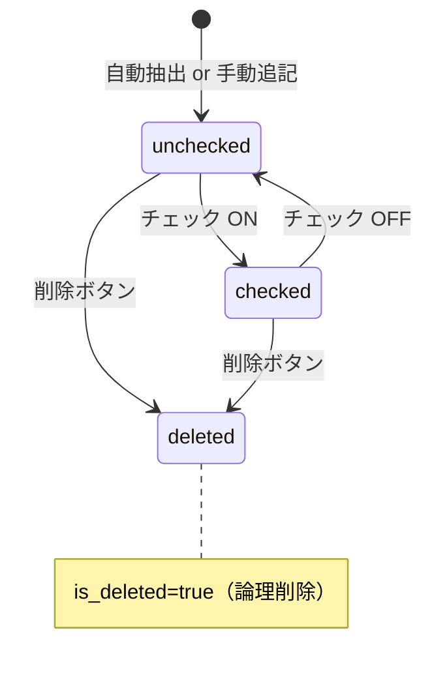

# 状態遷移図

## 1. 会議（Meeting）の状態遷移

```mermaid
stateDiagram-v2
    [*] --> recording : 録音開始 or ファイルインポート

    recording --> processing : 録音停止 or インポート完了
    recording --> error : STT失敗 / Voskモデル未配置 / ファイル変換失敗

    processing --> done : STT＋生成完了
    processing --> error : 処理失敗

    done --> [*] : ユーザーが手動削除
    error --> [*] : ユーザーが手動削除
```

---

## 2. アプリ起動の状態遷移

```mermaid
stateDiagram-v2
    [*] --> checking_model : アプリ起動

    checking_model --> model_error : Voskモデル未配置
    checking_model --> checking_db : Voskモデル存在

    model_error --> checking_model : ユーザーがモデルを配置してアプリ再起動

    checking_db --> db_repair : DB破損検出
    checking_db --> running : DB正常

    db_repair --> running : DBファイル削除・再作成

    running --> [*] : アプリ終了
```

---

## 3. ToDo項目の状態遷移

```mermaid
stateDiagram-v2
    [*] --> unchecked : 自動抽出 or 手動追記

    unchecked --> checked : チェック ON
    checked --> unchecked : チェック OFF

    unchecked --> deleted : 削除ボタン
    checked --> deleted : 削除ボタン

    note right of deleted : is_deleted=true（論理削除）
```
